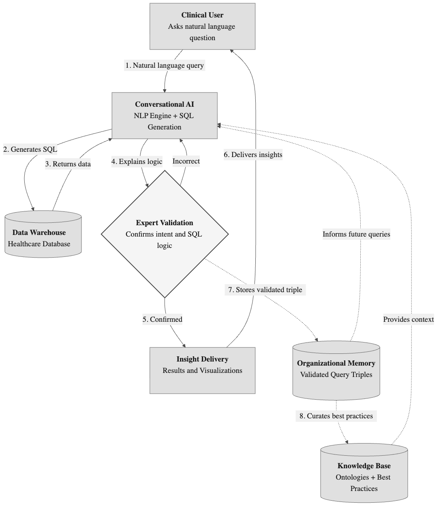
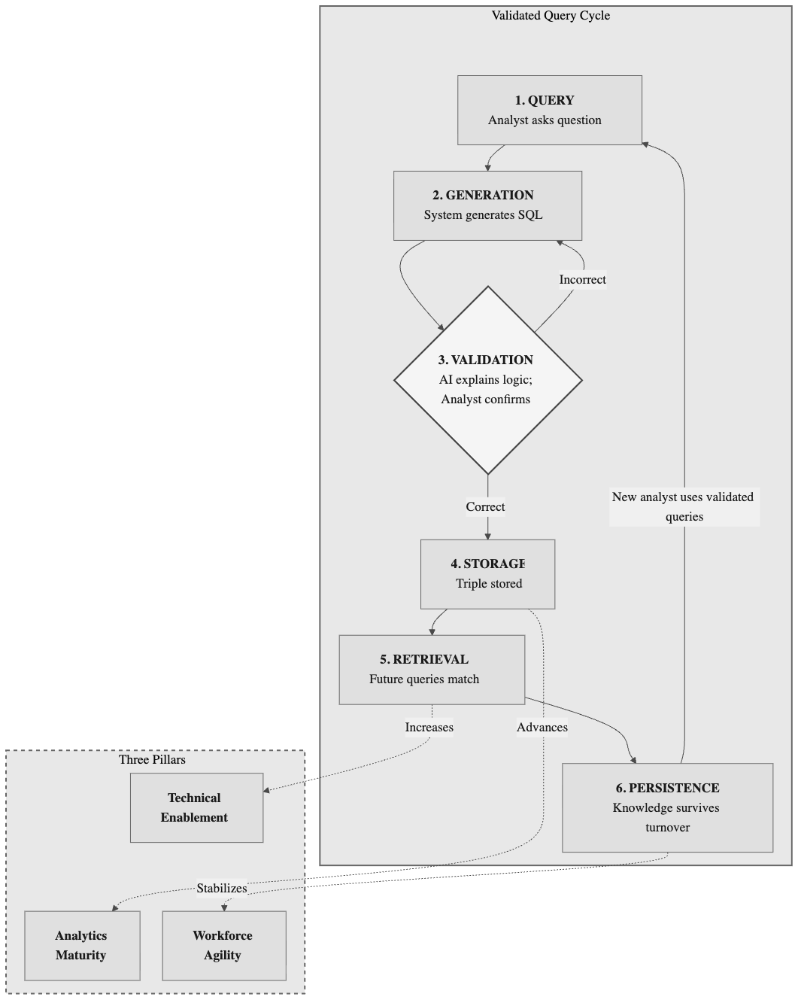

# The Triple Threat: Institutional Amnesia in Healthcare Analytics

The healthcare analytics landscape is currently paralyzed by a "Triple Threat" of compounding failures: (1) persistently *Low Analytics Maturity*, where despite decades of investment, as of late 2024 only 39 organizations globally had reached the top tiers of the Healthcare Information and Management Systems Society (HIMSS) Adoption Model for Analytics Maturity (AMAM) [@himss2024; @himss2024news]; (2) a *Semantic Gap* between clinical intent and technical schema implementation [@gal2019; @zhang2024]; and (3) a profound crisis of *Workforce Instability* that creates "Institutional Amnesia" [@hong2025].

While technical barriers and maturity models are well-documented, the workforce dimension has shifted from a management concern to an existential threat. Modern longitudinal data on analytics staff is fragmented, but the available signals are alarming. As of 2024, 53% of healthcare chief information officers (CIOs) have held their roles for less than three years [@wittkieffer2024], creating a strategic vacuum at the top. At the operational level, global nurse turnover runs at 16% to 18% annually [@ren2024; @wu2024], and a 2025 study found that 55% of public health informatics specialists intend to leave their positions [@rajamani2025].

This turnover creates what public administration scholars term *institutional amnesia* [@pollitt2000; @stark2019] and organization science studies as *organizational forgetting* [@deholan2004; @rao2006]: in healthcare analytics, the systematic erasure of the tacit knowledge required to interpret complex health data. In healthcare, "data" is never raw; it is wrapped in layers of institutional context (billing rules, workflow workarounds, and unwritten exclusions) [@gitelman2013]. When the analyst who knows that "exclusion code 99" actually means "hospice transfer" leaves, that knowledge evaporates. The organization does not just lose an employee; it loses the ability to accurately measure its own performance.

Current literature approaches these problems in isolation. Analytics maturity models (e.g., HIMSS AMAM) assume a stable workforce capable of linear progression [@himss2024]. Technical solutions (e.g., natural language to SQL, or NL2SQL) assume a stable schema and clear intent [@wang2020]. Neither accounts for the reality of the "Great Resignation," where the rate of knowledge loss often exceeds the rate of knowledge capture [@rao2006].

Traditional knowledge management strategies (wikis, data dictionaries, and documentation) have failed because they are *passive* [@mayo2016]. They require overworked staff to stop working and write down what they know. In a high-burnout environment, this documentation is the first casualty. As a result, healthcare systems are trapped in a Sisyphus-like cycle: hiring new analysts who spend their limited tenure relearning the same institutional secrets, only to leave just as they become productive [@ledikwe2013; @mantas2010]. A foundational 2004 study established that technical IT staff in organizations where IT is a support function, as in healthcare delivery, had the lowest expected tenure of any organizational category at just 2.9 years [@ang2004]. That this two-decade-old study remains a key benchmark is itself evidence of the crisis: the industry lacks the stability to track its own attrition. Contemporary signals, detailed below, suggest the situation has worsened.

This viewpoint article addresses a critical socio-technical gap:
*How can health systems maintain analytics maturity when workforce turnover exceeds the speed of documentation?*

As a Viewpoint, this paper deliberately advances a prescriptive position: that healthcare organizations should shift from passive knowledge management to active, artifact-based governance. The analysis below is grounded in descriptive evidence of why current approaches fail, but the architectural recommendations are intentionally directive.

We propose that the solution lies not in better documentation, but in a fundamental architectural shift: moving from *passive* knowledge management to *Human-in-the-Loop Knowledge Governance (HITL-KG)*.

# Theoretical Grounding: SECI and the Unstable Workforce

We ground our analysis in Nonaka's SECI model of knowledge creation [@farnese2019], informed by a narrative review of the literature across healthcare analytics maturity, workforce turnover dynamics, and natural language processing, with grey literature assessed using the AACODS (Authority, Accuracy, Coverage, Objectivity, Date, Significance) checklist [@tyndall2010]. Grey literature was retained only when no peer-reviewed equivalent existed or when it provided unique industry data. The SECI model describes organizational knowledge as emerging through a continuous cycle of four conversion modes:

1. *Socialization* (tacit to tacit): Knowledge transfers through shared experience and co-located practice, as when a senior analyst teaches a junior colleague the unwritten rules of a clinical dataset.
2. *Externalization* (tacit to explicit): Individuals articulate tacit know-how into explicit forms such as documents or coded artifacts, as when an analyst records why a specific exclusion code maps to hospice transfers.
3. *Combination* (explicit to explicit): Separately documented knowledge is integrated and systematized into broader structures, as when data dictionary entries are consolidated into a governed analytics catalog.
4. *Internalization* (explicit to tacit): Individuals learn from documented knowledge and convert it into personal expertise through practice, as when a new analyst studies validated query libraries.

In a healthy organization, these four modes form a self-reinforcing spiral: tacit insights become documented, documentation becomes systematized, and systematized knowledge is internalized by new members who then generate fresh tacit insights [@farnese2019]. When any mode breaks down, the spiral stalls. In healthcare analytics, the breakdown is at the very first stage.

The three-pillar structure aligns with established models across healthcare informatics and knowledge management (Table 1):

| Pillar | HIMSS AMAM Alignment | DIKW Hierarchy | Knowledge Management |
|:---|:---|:---|:---|
| Analytics Maturity | Stages 0-7 progression | Data → Information | Organizational Learning |
| Workforce Agility | Implicit in advanced stages | Knowledge (tacit) → Wisdom | Tacit Knowledge Transfer |
| Technical Enablement | Stages 6-7 requirements | Information → Knowledge | Knowledge Codification |

: Framework alignment with established models. \label{tab:alignment}

HIMSS AMAM provides organizational benchmarks but does not address workforce knowledge retention. The Data, Information, Knowledge, Wisdom (DIKW) hierarchy explains progression from raw data to actionable insight but does not account for institutional memory loss. The three-pillar framework synthesizes these perspectives, positioning workforce dynamics as the critical enabler connecting data access (analytics maturity) with organizational wisdom (knowledge preservation) [@farnese2019; @rao2006].

## The Broken Cycle: Socialization Failure
In Nonaka's model, *Socialization* is the foundational conversion mode: the primary channel through which newcomers absorb tacit context that formal training cannot convey [@farnese2019]. Socialization depends on two preconditions: sustained interaction and sufficient temporal overlap between knowledge holders and receivers [@foos2006]. It is, in effect, an apprenticeship model requiring years of shared practice.

In the current healthcare environment, this mechanism has collapsed. The leadership and operational turnover documented above reveals an "apprenticeship window" shorter than the knowledge transfer cycle it must support: 30% of new employees depart within their first year [@nsi2025], while specialized informatics roles require 18 to 24 months to reach fluency [@ledikwe2013]. The arithmetic is unforgiving: by the time a new analyst has absorbed enough tacit context to be productive, their mentor may already be gone, and the new analyst is themselves halfway through an average tenure.

High turnover rates fracture the social networks required for mentorship [@wu2024; @ren2024]. The resulting knowledge loss is compounding: each departure removes a node from the organization's informal knowledge network, making subsequent Socialization attempts less effective because fewer experienced practitioners remain to serve as mentors [@massingham2018]. Socialization is no longer a viable strategy for resilience.

## The Solution: Externalization via Socio-Technical Artifacts
To survive, organizations must shift reliance from Socialization to *Externalization*: converting tacit knowledge into explicit, durable artifacts [@zhang2025]. However, traditional Externalization (writing wikis, maintaining data dictionaries, composing runbooks) suffers from two critical weaknesses. First, it is passive: it requires overworked staff to interrupt their workflow and perform a separate documentation task [@goffin2011]. In a high-burnout environment where organizations face persistent attrition and talent shortages [@himssworkforce2024], this discretionary documentation is the first casualty. Second, it is low-fidelity: the act of writing down tacit knowledge inevitably loses nuance, context, and the conditional logic that makes institutional knowledge valuable [@foos2006]. The result is documentation that exists but does not adequately capture what the departing expert actually knew.

We propose a form of *active* Externalization: one that captures tacit knowledge as a byproduct of the daily analytics workflow rather than a separate documentation burden. The mechanism is a new socio-technical artifact: the *Validated Query Triple* (see Multimedia Appendix 1 for worked examples).
This artifact consists of:
1.  *Natural Language Intent*: The clinical business question (e.g., "Hypertension readmissions excluding planned transfers").
2.  *Executable SQL*: The technical implementation.
3.  *Rationale Metadata*: The "why" behind the logic (e.g., "Excluding status 02 per Centers for Medicare and Medicaid Services (CMS) 2025 rule").

By capturing these three components *during the act of analytics*, we transform the ephemeral work of query generation into a permanent institutional asset [@moore2018].

# Human-in-the-Loop Knowledge Governance

We propose *Human-in-the-Loop Knowledge Governance (HITL-KG)* as the overarching governance framework, extending the knowledge governance approach [@foss2007] with the Validated Query Cycle as its core operational process. This framing reflects that the system serves as a governance mechanism, not just a productivity tool.

## The HITL-KG Architecture

The HITL-KG architecture (Figure 1) functions as a *Governance Forcing Function*. It inserts a mandatory validation step into the analytics workflow, preventing laundered hallucinations while capturing expert knowledge.

{width=86.5%}

A clinical user's natural language query (step 1) is translated to SQL and run against the data warehouse (steps 2-3); an expert validation gate (step 4) either returns confirmed insights (steps 5-6) or loops back for correction. Confirmed query triples enter organizational memory (step 7, dashed line), which informs future queries and curates the knowledge base (step 8), closing a continuous-learning loop in which best practices evolve rather than remain static.

Figure 2 summarizes the corresponding six-step Validated Query Cycle, tracing queries from clinical intent through expert validation into durable organizational memory.

{height=6.67in}

A natural language question (step 1) yields candidate SQL (step 2) that the analyst validates against the system's explained logic (step 3), looping back if incorrect. Validated triples are stored in organizational memory (step 4), matched by future queries (step 5), and persist across staff turnover (step 6). Dashed arrows mark the pillar outcomes: storage advances analytics maturity, persistence stabilizes workforce agility, and retrieval increases technical enablement.

## The Process of Externalization
The cycle proceeds from AI query generation [@lee2023] through semantic translation to *Expert Validation*, the critical moment of Externalization, where the domain expert confirms or corrects the AI's interpretation and thereby captures tacit knowledge [@bravorocca2023; @mosqueirarey2023]. The validated triple is hashed and stored in organizational memory [@benbya2004], then retrieved ahead of future probabilistic generation [@whittaker2008]. Multimedia Appendix 1 details each step alongside worked examples.

## Comparison with Existing Approaches

Organizations have addressed institutional memory loss through several strategies, each with limitations HITL-KG overcomes.

*Code-based semantic layers* (e.g., dbt, LookML) encode business logic in version-controlled repositories, but suffer "schema rot" where electronic medical record (EMR) data models change frequently and maintenance exceeds high-turnover teams' capacity, misaligning the layer from the underlying data [@battula2025]. HITL-KG's validated query triples share the version-control principle but add the rationale metadata semantic layers lack: not just *what* a query does, but *why*.

*Traditional knowledge management* (wikis, data dictionaries, runbooks) relies on passive capture where users must stop working to document, which reduces participation and produces inaccurate records under cognitive load [@mayo2016; @goffin2011]. Such documentation might suffice for a small, stable query set, but real workloads are neither: more than half of analytical queries recur in large production workloads [@jindal2019], yet even small databases log hundreds to thousands of distinct query strings [@kul2018], so a fixed set of documented queries captures neither the large recurring core nor the evolving ad-hoc tail. HITL-KG instead implements active capture across both regimes: the query itself is the documentation, validated at the point of use [@moore2018].

*Unsupervised AI querying* removes human oversight entirely; current NL2SQL accuracy makes this unsafe for clinical analytics [@ziletti2024]. HITL-KG occupies the middle ground: AI generates, humans validate.

# The Evidence Base: Three Pillars

The evidence presented below supports the existence and severity of the problem HITL-KG addresses, and the maturity of the technologies it requires. It does not constitute empirical validation of the framework itself, which remains a theoretically grounded, testable proposition whose empirical evaluation is the subject of future work.

The HITL-KG framework is supported by three pillars of empirical evidence synthesized from the literature cited throughout this article.

## Pillar 1: Analytics Maturity Evidence
*Analytics maturity* describes an organization's progression in using data and quantitative models for fact-based decisions [@davenport2007], a construct operationalized by staged maturity models that extend beyond the HIMSS AMAM [@grossman2018; @langer2025]. Healthcare maturity remains chronically low. Assessments reveal only 26 organizations achieved Stage 6 and 13 reached Stage 7 by late 2024 [@himss2024; @himss2024news]. Because AMAM assessment is voluntary and self-selected, these figures likely overrepresent analytics-committed organizations, so low maturity may be even more widespread than the counts suggest [@halbesleben2013; @tomaskovic1994]. The corollary is that the vast majority of organizations remain at the lower stages, characterized by fragmented data and limited predictive capabilities [@health2020]. However, maturity is not merely an IT metric; it is a clinical safety predictor. In HIMSS's companion Electronic Medical Record Adoption Model (EMRAM), which measures the EMR adoption underlying analytics capability, levels 6-7 correlate with 3.25 times higher odds of better Leapfrog Safety Grades [@snowdon2024]. Low maturity creates a "low-maturity trap" where data quality issues (such as the 39-71% missing data rates in cancer databases [@yang2021]) remain uncorrected because the experts who understand the context are leaving.

Critically, low maturity is not simply a status; it is a self-reinforcing trap. Organizations at Stages 0-3 lack the automated monitoring and data governance infrastructure needed to detect their own deficiencies, so poor data quality goes unrecognized. The clinical consequences are measurable: one Medicare accountable care organization (ACO) that implemented analytics to overcome electronic health record (EHR) fragmentation reduced readmission rates from 24% to 17.8% and achieved $1.6 million in cost savings [@latrella2024]. Yet data interoperability remains a leading obstacle to analytics adoption [@gal2019; @zhang2024]. Barriers including employee resistance to change and lack of organizational readiness further stall data-driven initiatives [@shahbaz2019; @kamble2019]. The trap thus compounds: each year of delayed investment widens the gap between what the organization could know and what it does know.

## Pillar 2: Workforce Agility Evidence
*Workforce agility* is a workforce's capacity for proactivity, adaptability, and resilience under change [@breu2002; @tessarini2021]. In healthcare analytics, the evidence below documents the instability that systematically erodes this capacity. The cost of turnover in informatics is higher than standard IT. Knowledge loss can cost up to three times annual salary [@massingham2018; @wynendaele2025]. In clinical informatics specifically, replacement costs range from $50,000 to $230,000 per departing employee, with a single department losing 39 staff in one year at a total cost of up to $8.97 million [@hackney2024]. With 30% of new employees leaving within their first year [@nsi2025], healthcare IT professionals spend a limited portion of their employment at full productivity, as specialized roles require 18-24 months to reach fluency [@ledikwe2013]. This "revolving door" prevents the accumulation of the "Collective Knowledge Structures" required for complex task performance [@rao2006].

The workforce crisis operates at multiple reinforcing levels, as detailed in the Theoretical Grounding section: leadership churn, operational shortages, and foundational attrition collectively prevent the sustained mentorship that Socialization requires. This multi-level instability ensures that the temporal overlap between experienced practitioners and newcomers rarely materializes.

## Pillar 3: Technical Enablement Evidence
*Technical enablement* denotes the technologies and practices that let non-specialist domain users access and analyze data without heavy reliance on central IT [@alpar2016; @banihani2020]. NL2SQL technology has matured along a clear accuracy gradient: general-purpose models achieve approximately 65% execution accuracy on healthcare-specific benchmarks such as MIMICSQL [@blaskovic2025]; domain-adapted systems like MedT5SQL reach 80% [@marshan2024]; and architecturally specialized approaches combining large language models (LLMs) with structured knowledge representations achieve 94% on the same benchmarks [@chen2026graph]. While insufficient for unsupervised clinical deployment [@ziletti2024], this gradient demonstrates that the generation engine required for HITL-KG is viable within a human-validated workflow. Notably, high benchmark accuracy does not guarantee real-world generalization: evaluation on more challenging dataset splits reveals accuracy drops from 92% to 28% [@tarbell2024], reinforcing the necessity of the human-in-the-loop architecture. Healthcare-specific natural language interfaces such as Criteria2Query achieve fully automated cohort query formulation in 1.22 seconds per criterion [@yuan2019], with over 80% of clinical users indicating willingness to adopt such tools.

However, NL2SQL is an enabler, not a solution in itself. Its deeper significance lies in the organizational prerequisites it demands. For an AI system to translate a natural language question into a correct SQL query, the organization must first establish validated data models, explicit business logic definitions, and codified domain terminology [@gal2019; @zhang2024]. This reframes NL2SQL from a convenience tool into a catalyst for the kind of systematic knowledge externalization that the HITL-KG framework requires. The interface bridges the semantic gap between clinical experts and technical schema, allowing non-technical domain experts to interact with data alongside broader modernization efforts [@anthropic2025; @hendrix1978; @ogunwole2023; @arora2025]. The very difficulty of making NL2SQL work correctly thus becomes a governance opportunity: it compels organizations to surface and formalize tacit knowledge that would otherwise depart with its experts.

# Organizational Self-Assessment

To operationalize the framework, we propose a *Three-Pillar Assessment Rubric* (Table 2) that enables healthcare organizations to evaluate their current position across each pillar and identify compounding vulnerabilities.

## Why Assessment, Not Just Maturity

As noted, the maturity models and knowledge management frameworks in Table 1 assume linear progression by a stable workforce [@himss2024]. In practice, an organization that reaches AMAM Stage 5 but regresses to Stage 3 after the departure of two senior analysts has not failed to mature; it has failed to be *resilient*. A recent systematic review of organizational resilience measurement in healthcare found no consensus on what to measure [@ignatowicz2023]. Only four instruments have been developed specifically for healthcare, and only two have been validated [@ratliff2025]. The Three-Pillar Assessment addresses this gap by organizing evidence-based indicators around the domains where institutional amnesia operates, measuring not just where an organization stands but how vulnerable it is.

## The Three-Pillar Rubric

Each indicator is scored as Low, Medium, or High Strength using evidence-based anchors from the literature reviewed in the preceding Evidence Base section. Organizations scoring predominantly "Low Strength" across multiple pillars face the self-reinforcing degradation cycle that the framework identifies as the central threat. Table 2 summarizes the nine indicators; the full rubric with scoring anchors and evidence appears in Multimedia Appendix 2.

| Pillar | Indicators |
|:---|:---|
| Analytics Maturity | HIMSS AMAM stage; self-service analytics; AI/NL interface |
| Workforce Agility | First-year analytics staff turnover; leadership tenure; knowledge concentration |
| Technical Enablement | Data access; interoperability; schema coupling |

: Three-Pillar Assessment Rubric indicators (full rubric with anchors in Multimedia Appendix 2). \label{tab:rubric}

The "Schema Coupling" indicator can be operationalized through *Continuous Analytic Integration*: treating validated query triples as software assets within a CI/CD pipeline that detects data and schema drift [@valiaiev2025; @mannapur2025; @battula2025]. When a data warehouse schema is updated, the system automatically re-runs stored queries and flags failures, transforming institutional memory into a living test suite [@betha2023; @kottam2025].

The rubric complements rather than replaces AMAM. Where AMAM measures the sophistication of analytical capabilities at a point in time, the Three-Pillar Assessment reveals how vulnerable those capabilities are to the compounding effects of turnover, low maturity, and technical barriers. Used together, they provide a two-dimensional view of analytics health.

# The Validator Paradox and Standard Work
A critical objection to HITL-KG is circular: if the framework requires domain experts to validate AI-generated queries, and the core problem is that domain experts are leaving, then the framework fails precisely when it is most needed. This *Validator Paradox* represents the strongest counterargument to the approach proposed here, and addressing it requires moving beyond simplistic reassurance.

The resolution draws on Lean management's concept of "Standard Work" [@alukal2006]. In this framing, validation is not the establishment of *eternal truth* but the documentation of the *current known standard*. Each validated query triple records the best available understanding of how a business question maps to a data operation at that moment; the validation is time-stamped and contextual, not permanent. Critically, as Alukal and Manos [@alukal2006] establish, standard work is the prerequisite for Kaizen (continuous improvement): without a documented baseline, there is no foundation to improve upon. Each validated query therefore establishes a floor, not a ceiling. The next expert, veteran or mid-career hire, inherits a baseline to refine rather than reconstructing institutional knowledge from scratch.

This mechanism functions as what we term a *Knowledge Ratchet*, consistent with findings on collective knowledge structures [@rao2006]. Each validated triple prevents regression below the last confirmed state. Even if a subsequent validator is less experienced, the organization cannot slide below the previously validated standard. The analogy to version control is instructive: each commit preserves a known-good state that future contributors build upon. The ratchet does not guarantee forward progress, but it prevents the catastrophic backsliding that is the central failure mode of institutional amnesia.

Real-world evidence supports this: UC Davis Health moved from AMAM Stage 0 to Stage 6 by establishing standardized "S.M.A.R.T." definitions for its analytics metrics [@himss2025ucdavis]. Those codified standards survived staff turnover because they existed as organizational artifacts rather than knowledge held solely by their creators. The HITL-KG validated query library serves an analogous function: it encodes analytical decisions into durable, retrievable structures that persist independent of any single analyst's tenure.

The Validator Paradox is not fully resolved: below a minimum viable expertise threshold, validation becomes meaningless. A junior analyst rubber-stamping AI-generated output without genuine comprehension provides no knowledge ratchet; the validation artifact exists, but its epistemic value is nil. Identifying this threshold remains an open empirical question; future work should measure it via controlled hallucination injection studies, in which AI-generated queries containing deliberate errors are presented to validators of varying experience levels.

We propose a provisional three-tier governance model, informed by risk-stratified AI oversight frameworks [@kumar2025caos; @labkoff2024], to degrade gracefully when expertise is scarce. *Full validation*: a domain expert with schema-level knowledge reviews the query triple and confirms semantic alignment (the default). *Constrained validation*: when no fully qualified validator is available, a less experienced analyst reviews the triple against previously validated queries for the same data domain, flagging deviations for deferred expert review; the triple is stored with "provisional" status. *Automated matching*: for queries that match an existing validated triple with high semantic similarity, the system accepts the match without human review, logging it for periodic audit.

Organizational governance requirements include who can validate queries (domain expertise thresholds), review workflows for high-stakes queries, query versioning as schemas evolve, and retrieval policies. Drawing on established master data governance practice [@loshin2010], organizations can designate specific validated triples as "Golden Queries," certified by a governance committee as the authoritative source of truth for key metrics. Only these certified triples serve as official standards, mitigating Shadow IT risks [@zimmermann2017] while preserving analytical agility.

# Safety as Cognitive Forcing

HITL-KG is fundamentally a *safety mechanism*, not a productivity tool. The central risk of unsupervised AI in clinical analytics is what we term "laundering hallucinations": a plausible-sounding but factually incorrect query result that enters the decision pipeline undetected and influences clinical or operational choices. Because large language models generate fluent, confident output regardless of correctness, errors arrive dressed in the language of expertise, harder to catch than obviously malformed output.

HITL-KG mitigates this risk through *Cognitive Forcing Functions* [@ziletti2024], a design pattern borrowed from clinical decision-making and safety engineering. Requiring the AI to explain its reasoning *before* presenting results forces the validator into System 2 (analytical, deliberate) thinking rather than System 1 (fast, heuristic) acceptance of superficially plausible output. User studies confirm the practical benefit: structured explanation reduces error recovery time by 30 to 40 seconds compared to unstructured output review [@ipeirotis2025].

Critically, the human validator's value is not merely assumed. Recent studies show that human oversight measurably improves AI-generated analytics: large-language-model output verified by a reviewer outperformed a human-only workflow (91.0% versus 89.0% accuracy) across six systematic reviews [@gartlehner2025], and a text-to-SQL validation gate in which experts correct generated queries improved semantic correctness by 28.4% over end-to-end model output [@benzarti2026]. These gains are conditional on well-designed interaction [@ning2024]; the comparative effectiveness of HITL-KG itself remains the subject of the planned empirical validation.

The parallel to aviation safety is instructive: checklists and mandatory call-outs made commercial aviation exceptionally safe not by eliminating human error but by surfacing errors before they propagate. HITL-KG applies the same principle: the mandatory validation step is an analytical "call-out" that interrupts uncritical acceptance, so the friction of validation is not a cost but the mechanism of safety itself.

# Structural Barriers: Why the Problem Persists
Failed standardization approaches (e.g., IBM Watson Health [@ibm2022; @strickland2019], Haven [@lavito2021; @acchiardo2021]) demonstrate that centralized models fail clinical reality. Metadata uncertainties and "messy" institution-specific business logic require localized solutions [@gal2019; @strickland2019]. HITL-KG addresses this by capturing *local* logic rather than enforcing *global* standards.

# Limitations
This work is a narrative, design science informed framework rather than a systematic review or multi-site empirical evaluation. The literature base is concentrated on English-language sources and recent (2024-2026) workforce and NL2SQL studies, so findings may not capture all regional, specialty-specific, or technological contexts. The HITL-KG architecture and the proposed Three-Pillar Assessment Rubric are conceptual artifacts that require future implementation and validation in diverse health systems before their effectiveness and generalizability can be fully established.

HITL-KG also complements rather than replaces workforce development: it decouples institutional knowledge from individual tenure, but still presumes investment in the training and analytics literacy through which staff learn to pose, validate, and interpret queries [@ledikwe2013]. This complementarity also bounds the framework. Where data models and business rules change continually, no approach is self-maintaining; precisely because retained expertise cannot manually keep pace with constant change, knowledge must be externalized into curated artifacts, yet the validated query library must itself be actively maintained, a burden the Continuous Analytic Integration mechanism mitigates but does not remove.

# Implications and Future Research

The crisis of Institutional Amnesia in healthcare requires a structural shift. As long as analytical maturity is tied to individual tenure, organizations will remain fragile. By implementing *Human-in-the-Loop Knowledge Governance*, health systems can decouple intelligence from turnover, building a library of validated knowledge that ensures maturity advances even as the workforce evolves.

Future research should empirically validate and refine the HITL-KG framework and the proposed Three-Pillar Assessment Rubric. Priority questions include: how pillar scores correlate with observed continuity of analytics performance during leadership and staff turnover; whether HITL-KG mediated natural language to SQL workflows reduce error rates, recovery time, and rework compared to baseline tooling; and which governance patterns most effectively balance safety, transparency, and equity when human validators operate at scale. Prospective multi-site implementation studies, controlled user experiments, and qualitative implementation research will be needed to test these claims across diverse organizational, regulatory, and data environments.

# Acknowledgments

The author (S.T.H.) is the sole author and takes full responsibility for the manuscript's content. Generative AI disclosure: generative AI was used to assist this work, specifically Gemini CLI (Gemini 3, Google) and Claude Code (Claude 5, Anthropic) for manuscript editing, language refinement, and literature search. Generative AI was not used to generate research findings, data, or conclusions; the author conducted the research and verified all claims, citations, and AI-assisted text. Figures were generated using the Mermaid graph language.

# Author Contributions

S.T.H.: Conceptualization, Investigation, Methodology, Writing (Original Draft), Writing (Review and Editing), Visualization.

# Conflicts of Interest

The author declares the following competing interests: Samuel T Harrold is a contract product advisor at Yuimedi, Inc., which develops healthcare analytics software including conversational AI platforms relevant to this review's subject matter. The author is also employed as a Data Scientist at Indiana University Health. This paper presents an analytical framework derived from published literature and does not evaluate or recommend specific commercial products, including those of the author's affiliated organizations. The views expressed are the author's own and do not represent the official positions of Indiana University Health or Yuimedi, Inc.

# Data Availability

This is a narrative review synthesizing existing literature. No primary datasets were generated or analyzed. All data cited are from publicly available peer-reviewed publications, industry reports, and academic theses, referenced in the bibliography. The manuscript source, build pipeline, and literature review tool are available at https://doi.org/10.5281/zenodo.18264359

# Funding

Yuimedi, Inc. provided financial support for the author's time researching and writing this manuscript.

# Abbreviations

AACODS: Authority, Accuracy, Coverage, Objectivity, Date, Significance
ACO: Accountable Care Organization
AI: Artificial Intelligence
AMAM: Adoption Model for Analytics Maturity
BI: Business Intelligence
CI/CD: Continuous Integration and Continuous Delivery
CIO: Chief Information Officer
CMS: Centers for Medicare and Medicaid Services
DIKW: Data, Information, Knowledge, Wisdom
DSR: Design Science Research
EHR: Electronic Health Record
EMR: Electronic Medical Record
EMRAM: Electronic Medical Record Adoption Model
HIMSS: Healthcare Information and Management Systems Society
HITL: Human-in-the-Loop
HITL-KG: Human-in-the-Loop Knowledge Governance
IT: Information Technology
LLM: Large Language Model
NL2SQL: Natural Language to SQL
NLP: Natural Language Processing
SECI: Socialization, Externalization, Combination, Internalization
SQL: Structured Query Language

# References

::: {#refs}
:::
