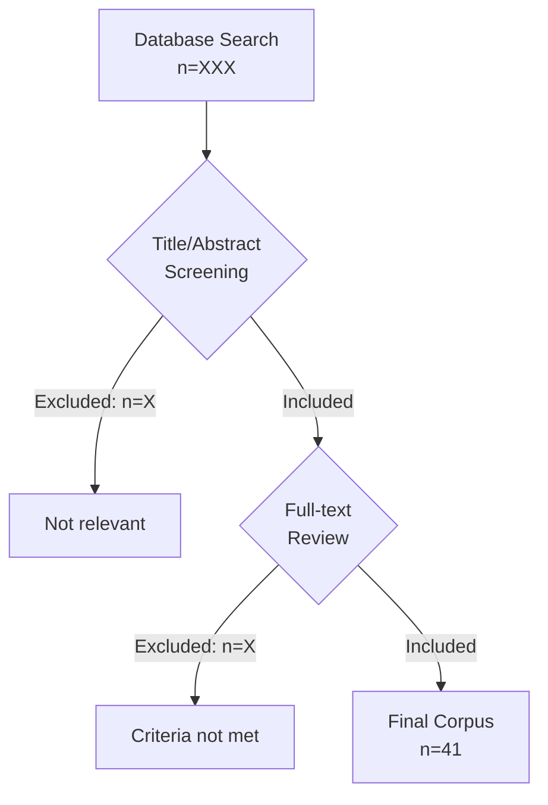

# Implementation Plan: Paper 1 Revisions

**Type:** feature
**Slug:** paper-1-revisions
**Date:** 2025-12-16
**GitHub Issues:** #310-#324, #270, #271 (17 total with `paper-1` label)

## Overview

Transform Paper 1 from solution-advocacy piece to pure analytical framework contribution.
This is a **documentation-only feature** - all changes are to `paper.md` and supporting files.

## Execution Order

```
Epic 1 ──> Epic 2 ──> Epic 3 ──> Epic 4 ──> Epic 5 ──> Epic 6
(removal)  (4.7)     (method)   (framework) (language) (submit)
```

---

## Epic 1: Critical Content Removal (P0)

**Goal:** Remove solution-advocacy content to establish paper as pure analytical framework

### Task 1.1: Remove Section 5 (Proposed Solution)

**Priority:** P0 (Critical)
**GitHub Issue:** #319

**Files:**
- `paper.md`

**Description:**
Remove Section 5 "Proposed Solution" entirely. Content preserved in git history for Paper 2.

**Steps:**
1. Locate Section 5 header and all content until Section 6
2. Delete entire section (~140 lines)
3. Do NOT renumber sections yet (wait for Epic 1 completion)

**Acceptance Criteria:**
- [ ] Section 5 header removed
- [ ] All Section 5 content removed
- [ ] Content exists in git history

**Verification:**
```bash
grep -c "## 5\." paper.md  # Should return 0
```

**Dependencies:** None (start here)

---

### Task 1.2: Remove Section 6 (Evaluation)

**Priority:** P0 (Critical)
**GitHub Issue:** #317

**Files:**
- `paper.md`

**Description:**
Remove Section 6 "Evaluation" entirely. Content preserved in git history for Paper 2.

**Steps:**
1. Locate Section 6 header and all content until Section 7
2. Delete entire section (~70 lines)
3. Proceed to section renumbering

**Acceptance Criteria:**
- [ ] Section 6 header removed
- [ ] All Section 6 content removed
- [ ] Content exists in git history

**Verification:**
```bash
grep -c "## 6\." paper.md  # Should return 0
```

**Dependencies:** Task 1.1

---

### Task 1.3: Update Section Numbering and Cross-References

**Priority:** P0 (Critical)
**GitHub Issue:** N/A (required for integrity)

**Files:**
- `paper.md`

**Description:**
Renumber sections after removals and update all cross-references.

**Steps:**
1. Update section headers (7→5, 8→6, 9→7, 10→8)
2. Search for "Section 5" / "Section 6" references and update
3. Update table of contents if present
4. Verify no broken references

**Acceptance Criteria:**
- [ ] Section numbers sequential (1-8)
- [ ] No orphaned cross-references
- [ ] No references to removed sections

**Verification:**
```bash
./validate_documentation.sh  # Cross-reference validation
```

**Dependencies:** Tasks 1.1, 1.2

---

## Epic 2: Section 4.7 Revisions (P0/P1)

**Goal:** Remove speculative market claims, add research caveats

### Task 2.1: Remove "Structural Disincentives" Language

**Priority:** P0 (Critical)
**GitHub Issue:** #315

**Files:**
- `paper.md` (Section 4.7)

**Description:**
Remove speculative language about vendor "structural disincentives" for interoperability.

**Steps:**
1. Locate Section 4.7 "Why the Problem Persists"
2. Remove paragraphs claiming causal vendor motivations
3. Keep Watson Health [I9] and Haven [I10] as observed events only

**Acceptance Criteria:**
- [ ] No "structural disincentives" phrase
- [ ] No speculative causal claims about vendors
- [ ] Watson/Haven referenced as events, not evidence of motivation

**Verification:**
```bash
grep -i "structural disincentive" paper.md  # Should return nothing
grep -i "incentive.*vendor" paper.md  # Review results
```

**Dependencies:** Epic 1 complete

---

### Task 2.2: Reframe Watson Health/Haven as Observed Patterns

**Priority:** P0 (Critical)
**GitHub Issue:** #315

**Files:**
- `paper.md` (Section 4.7)

**Description:**
Rewrite Watson Health and Haven references as observed market events without causal attribution.

**Steps:**
1. Rewrite Watson Health [I9] discussion as factual discontinuation
2. Rewrite Haven [I10] dissolution as factual event
3. Remove any implication these prove vendor motivations

**Acceptance Criteria:**
- [ ] Watson Health described factually
- [ ] Haven described factually
- [ ] No causal attribution to vendor strategy

**Verification:**
```bash
# Manual review of Section 4.7
```

**Dependencies:** Task 2.1

---

### Task 2.3: Add Research Caveat Paragraph

**Priority:** P1 (High)
**GitHub Issue:** #316

**Files:**
- `paper.md` (Section 4.7)

**Description:**
Add explicit caveat acknowledging limitations of our analysis of market dynamics.

**Steps:**
1. Draft caveat paragraph (~4 lines)
2. Insert after reframed Watson/Haven discussion
3. Acknowledge correlation vs. causation

**Suggested text:**
> These observations represent documented market events; however, establishing causal
> mechanisms between organizational incentive structures and interoperability outcomes
> requires controlled empirical research beyond this review's scope.

**Acceptance Criteria:**
- [ ] Caveat paragraph present
- [ ] Explicitly acknowledges limitation
- [ ] Distinguishes observation from causation

**Verification:**
```bash
grep -i "causal" paper.md  # Should find caveat
```

**Dependencies:** Task 2.2

---

## Epic 3: Statistics & Methodology (P0/P1)

**Goal:** Strengthen methodology documentation and qualify statistics

### Task 3.1: Qualify [A10] Turnover Statistics

**Priority:** P0 (Critical)
**GitHub Issue:** #310

**Files:**
- `paper.md` (5 locations)

**Description:**
Add caveat language at all locations citing [A10] (2004) turnover data.

**Steps:**
1. Search for all `[A10]` citations in paper.md
2. Add qualification: "As of 2004" or similar temporal context
3. Ensure consistent wording across all 5 locations

**Acceptance Criteria:**
- [ ] All 5 [A10] citations qualified
- [ ] Consistent temporal caveat language
- [ ] Reader understands data age

**Verification:**
```bash
grep -n "\[A10\]" paper.md  # List all occurrences
```

**Dependencies:** Epic 1 complete

---

### Task 3.2: Add Search Strategy Table to Methodology

**Priority:** P0 (Critical)
**GitHub Issue:** #312

**Files:**
- `paper.md` (Section 3 Methodology)

**Description:**
Add table documenting literature search strategy.

**Steps:**
1. Create markdown table with columns: Database, Search Terms, Date Range, Results
2. Include: PubMed, Google Scholar, ACM DL, IEEE Xplore
3. Document date range and retrieval counts
4. Insert in Methodology section

**Table template:**
| Database | Search Terms | Date Range | Initial Results |
|----------|--------------|------------|-----------------|
| PubMed | "natural language" AND "SQL" AND "healthcare" | 2015-2024 | X |
| ... | ... | ... | ... |

**Acceptance Criteria:**
- [ ] Table present in Methodology
- [ ] All databases listed
- [ ] Date ranges documented
- [ ] Result counts included

**Verification:**
```bash
grep -A 10 "Search Strategy" paper.md
```

**Dependencies:** Epic 1 complete

---

### Task 3.3: Create Literature Flow Diagram (Mermaid)

**Priority:** P0 (Critical)
**GitHub Issue:** #311

**Files:**
- `figures/literature-flow.mmd` (new)

**Description:**
Create Mermaid diagram showing literature selection process.

**Steps:**
1. Create Mermaid flowchart
2. Show: Initial search → Screening → Eligibility → Included
3. Include counts at each stage

**Mermaid template:**


**Acceptance Criteria:**
- [ ] Mermaid file created
- [ ] Flow shows all stages
- [ ] Counts included

**Verification:**
```bash
cat figures/literature-flow.mmd
```

**Dependencies:** None (can parallel)

---

### Task 3.4: Generate Literature Flow JPG

**Priority:** P0 (Critical)
**GitHub Issue:** #311

**Files:**
- `figures/literature-flow.jpg` (generated)

**Description:**
Generate JPG from Mermaid source for paper inclusion.

**Steps:**
1. Use mmdc (Mermaid CLI) to generate PNG
2. Convert to JPG for paper format compatibility
3. Verify image quality

**Acceptance Criteria:**
- [ ] JPG file exists
- [ ] Image renders correctly
- [ ] Quality sufficient for publication

**Verification:**
```bash
ls -la figures/literature-flow.jpg
```

**Dependencies:** Task 3.3

---

### Task 3.5: Add Figure Reference in Methodology

**Priority:** P0 (Critical)
**GitHub Issue:** #311

**Files:**
- `paper.md` (Section 3 Methodology)

**Description:**
Add reference to literature flow figure in Methodology section.

**Steps:**
1. Add figure caption and reference
2. Use standard markdown image syntax
3. Reference figure in surrounding text

**Acceptance Criteria:**
- [ ] Figure referenced in text
- [ ] Caption descriptive
- [ ] Renders in PDF output

**Verification:**
```bash
./scripts/build_paper.sh --format pdf
```

**Dependencies:** Task 3.4

---

### Task 3.6: Document Single-Coder Limitation

**Priority:** P1 (High)
**GitHub Issue:** #313

**Files:**
- `paper.md` (Limitations section)

**Description:**
Explicitly acknowledge single-author/coder limitation for literature review.

**Steps:**
1. Add paragraph to Limitations section
2. Acknowledge single-coder risk for selection/interpretation bias
3. Note mitigation (if any) or acknowledge as limitation

**Acceptance Criteria:**
- [ ] Single-coder limitation stated
- [ ] Bias risk acknowledged
- [ ] Located in Limitations section

**Verification:**
```bash
grep -i "single.*coder\|single.*author" paper.md
```

**Dependencies:** Epic 1 complete

---

### Task 3.7: Add [A10] Limitation to Limitations Section

**Priority:** P1 (High)
**GitHub Issue:** #310

**Files:**
- `paper.md` (Limitations section)

**Description:**
Add explicit limitation about [A10] data age (2004).

**Steps:**
1. Draft limitation paragraph
2. Note 20-year age of primary turnover statistic
3. Recommend updated research

**Acceptance Criteria:**
- [ ] [A10] age limitation documented
- [ ] Located in Limitations section
- [ ] Suggests need for updated data

**Verification:**
```bash
grep -A 5 "\[A10\]" paper.md | grep -i "limit"
```

**Dependencies:** Task 3.1

---

## Epic 4: Framework Enhancement (P1/P2)

**Goal:** Add framework development rationale and theoretical grounding

### Task 4.1: Create "Framework Development and Validation" Section

**Priority:** P1 (High)
**GitHub Issue:** #321

**Files:**
- `paper.md` (new section after Methodology)

**Description:**
Add new section documenting how the three-pillar framework was developed.

**Steps:**
1. Create new section header
2. Document framework development process
3. Describe pillar identification methodology
4. Explain validation approach

**Acceptance Criteria:**
- [ ] New section present
- [ ] Development process documented
- [ ] Framework rationale clear

**Verification:**
```bash
grep "Framework Development" paper.md
```

**Dependencies:** Epic 3 complete

---

### Task 4.2: Add HIMSS AMAM / DIKW Mapping Table

**Priority:** P2 (Medium)
**GitHub Issue:** #322

**Files:**
- `paper.md` (Framework Development section)

**Description:**
Map three-pillar framework to established models.

**Steps:**
1. Create table mapping pillars to HIMSS AMAM stages
2. Create table mapping to DIKW hierarchy
3. Document theoretical alignment

**Table template:**
| Three Pillars | HIMSS AMAM | DIKW |
|---------------|------------|------|
| Analytics Maturity | Stages 0-7 | Data → Information |
| Workforce | N/A | Knowledge (tacit) |
| Technical Barriers | Stage 6-7 requirements | Information → Knowledge |

**Acceptance Criteria:**
- [ ] HIMSS AMAM mapping present
- [ ] DIKW mapping present
- [ ] Alignments explained

**Verification:**
```bash
grep -i "AMAM\|DIKW" paper.md
```

**Dependencies:** Task 4.1

---

### Task 4.3: Revise Conclusion for Framework Focus

**Priority:** P1 (High)
**GitHub Issue:** #320

**Files:**
- `paper.md` (Conclusion section)

**Description:**
Rewrite conclusion to emphasize framework contribution rather than solution advocacy.

**Steps:**
1. Remove "call to action" language
2. Remove vendor recommendations
3. Focus on framework's analytical value
4. Emphasize three-pillar contribution to field

**Acceptance Criteria:**
- [ ] No solution advocacy
- [ ] Framework contribution emphasized
- [ ] Scholarly tone maintained

**Verification:**
```bash
grep -i "call to action\|strategic imperative" paper.md  # Should return nothing
```

**Dependencies:** Epics 1-3 complete

---

### Task 4.4: Remove Solution Advocacy from Conclusion

**Priority:** P1 (High)
**GitHub Issue:** #320

**Files:**
- `paper.md` (Conclusion section)

**Description:**
Remove any remaining solution-focused language from conclusion.

**Steps:**
1. Search for product/vendor mentions
2. Remove implementation recommendations
3. Ensure focus on analytical framework

**Acceptance Criteria:**
- [ ] No product mentions in conclusion
- [ ] No vendor mentions in conclusion
- [ ] Pure analytical focus

**Verification:**
```bash
# Manual review of conclusion
```

**Dependencies:** Task 4.3

---

## Epic 5: Language & Tone (P1)

**Goal:** Remove promotional language and update COI statement

### Task 5.1: Remove "Strategic Imperative" Phrases

**Priority:** P1 (High)
**GitHub Issue:** #318

**Files:**
- `paper.md` (3 locations)

**Description:**
Remove all instances of "strategic imperative" promotional language.

**Steps:**
1. Search for "strategic imperative" (3 occurrences)
2. Replace with neutral alternatives or delete
3. Verify no instances remain

**Acceptance Criteria:**
- [ ] Zero "strategic imperative" instances
- [ ] Replacements maintain meaning
- [ ] Scholarly tone preserved

**Verification:**
```bash
grep -i "strategic imperative" paper.md  # Should return nothing
```

**Dependencies:** Epic 4 complete

---

### Task 5.2: Replace "Urgent Need" with "Identified Gap"

**Priority:** P1 (High)
**GitHub Issue:** #318

**Files:**
- `paper.md` (~3 locations)

**Description:**
Replace promotional "urgent need" language with neutral "identified gap."

**Steps:**
1. Search for "urgent need" or similar urgency language
2. Replace with "identified gap" or "documented need"
3. Maintain scholarly objectivity

**Acceptance Criteria:**
- [ ] No "urgent need" instances
- [ ] Neutral language used
- [ ] Meaning preserved

**Verification:**
```bash
grep -i "urgent" paper.md  # Should return nothing
```

**Dependencies:** Task 5.1

---

### Task 5.3: Replace "Devastating" with "Significant"

**Priority:** P1 (High)
**GitHub Issue:** #318

**Files:**
- `paper.md` (~2 locations)

**Description:**
Replace emotional "devastating" language with measured "significant."

**Steps:**
1. Search for "devastating" or similar emotional terms
2. Replace with "significant" or equivalent
3. Maintain factual basis

**Acceptance Criteria:**
- [ ] No "devastating" instances
- [ ] Measured language used
- [ ] Impact still conveyed

**Verification:**
```bash
grep -i "devastating" paper.md  # Should return nothing
```

**Dependencies:** Task 5.2

---

### Task 5.4: Remove Competitive Language

**Priority:** P1 (High)
**GitHub Issue:** #318

**Files:**
- `paper.md` (~3 locations)

**Description:**
Remove language suggesting competitive positioning or market differentiation.

**Steps:**
1. Search for competitive/market positioning language
2. Remove or neutralize
3. Focus on analytical contribution

**Acceptance Criteria:**
- [ ] No competitive positioning language
- [ ] Academic tone throughout
- [ ] Framework focus maintained

**Verification:**
```bash
grep -i "competitive advantage\|market position" paper.md  # Should return nothing
```

**Dependencies:** Task 5.3

---

### Task 5.5: Revise COI Statement

**Priority:** P0 (Critical)
**GitHub Issue:** #324

**Files:**
- `paper.md` or `metadata.yaml` (COI section)

**Description:**
Update Conflict of Interest statement for accuracy.

**Steps:**
1. Review current COI statement
2. Ensure accuracy per journal requirements
3. Disclose any relevant affiliations

**Acceptance Criteria:**
- [ ] COI statement accurate
- [ ] Meets journal requirements
- [ ] Author affiliations clear

**Verification:**
```bash
grep -i "conflict of interest\|COI" paper.md metadata.yaml
```

**Dependencies:** None (can parallel)

---

## Epic 6: Submission Preparation (Doc)

**Goal:** Create materials for external submission workflows

### Task 6.1: Create Expert Review Checklist

**Priority:** Doc
**GitHub Issue:** #323

**Files:**
- `ppr_review/expert-review-checklist.md` (new)

**Description:**
Create checklist for 2-3 expert reviewers to use when evaluating paper.

**Steps:**
1. Create new markdown file
2. Include sections: Framework validity, Evidence quality, Methodology, Language
3. Add specific questions for reviewers

**Acceptance Criteria:**
- [ ] Checklist file exists
- [ ] Covers all review areas
- [ ] Actionable questions included

**Verification:**
```bash
cat ppr_review/expert-review-checklist.md
```

**Dependencies:** Epics 1-5 complete

---

### Task 6.2: Create OSF Registration Draft

**Priority:** Doc
**GitHub Issue:** #314

**Files:**
- `ppr_review/osf-registration-draft.md` (new)

**Description:**
Draft post-hoc registration materials for Open Science Framework.

**Steps:**
1. Create registration template
2. Document research questions
3. Document methodology
4. Note this is post-hoc registration

**Acceptance Criteria:**
- [ ] OSF template complete
- [ ] Post-hoc nature acknowledged
- [ ] All required fields populated

**Verification:**
```bash
cat ppr_review/osf-registration-draft.md
```

**Dependencies:** Epics 1-5 complete

---

### Task 6.3: Create arXiv Submission Checklist

**Priority:** Doc
**GitHub Issue:** #270

**Files:**
- `ppr_review/arxiv-submission-checklist.md` (new)

**Description:**
Create checklist for arXiv preprint submission.

**Steps:**
1. Review arXiv requirements for cs.CL
2. Create submission checklist
3. Include: metadata, categories, PDF requirements
4. Note cross-listing strategy (cs.DB, cs.HC, cs.CY)

**Acceptance Criteria:**
- [ ] Checklist covers arXiv requirements
- [ ] Category selection documented
- [ ] PDF format requirements noted

**Verification:**
```bash
cat ppr_review/arxiv-submission-checklist.md
```

**Dependencies:** Epics 1-5 complete

---

### Task 6.4: Create Zenodo Submission Checklist

**Priority:** Doc
**GitHub Issue:** #271

**Files:**
- `ppr_review/zenodo-submission-checklist.md` (new)

**Description:**
Create checklist for Zenodo archive submission.

**Steps:**
1. Review Zenodo requirements
2. Create submission checklist
3. Include: DOI reservation, metadata, versioning
4. Document CC BY 4.0 license requirements

**Acceptance Criteria:**
- [ ] Checklist covers Zenodo requirements
- [ ] DOI process documented
- [ ] License requirements noted

**Verification:**
```bash
cat ppr_review/zenodo-submission-checklist.md
```

**Dependencies:** Epics 1-5 complete

---

## Summary

| Epic | Issues Closed | Net Line Change |
|------|---------------|-----------------|
| 1 | #319, #317 | -210 |
| 2 | #315, #316 | -6 |
| 3 | #310, #312, #311, #313 | +52 |
| 4 | #321, #322, #320 | +30 |
| 5 | #318, #324 | ~0 |
| 6 | #323, #314, #270, #271 | +250 (new files) |
| **Total** | **17 issues** | **~+116 (paper.md: -134)** |

## Quality Checklist

Before considering this feature complete:

- [ ] All 17 GitHub issues closeable
- [ ] `./validate_documentation.sh` passes
- [ ] `python scripts/validate_references.py --all` passes
- [ ] `./scripts/build_paper.sh --format all` succeeds
- [ ] No promotional language remains
- [ ] Framework contribution clear
- [ ] All submission materials prepared

## Risk Assessment

### High Risk Tasks

- **Tasks 1.1-1.3**: Section removal may break cross-references
  - Mitigation: Run validation after each task

- **Task 4.3**: Conclusion rewrite changes paper focus significantly
  - Mitigation: Preserve original in git history, careful review

### Medium Risk Tasks

- **Tasks 3.3-3.5**: Figure generation requires tooling
  - Mitigation: Verify mmdc installation, test early
