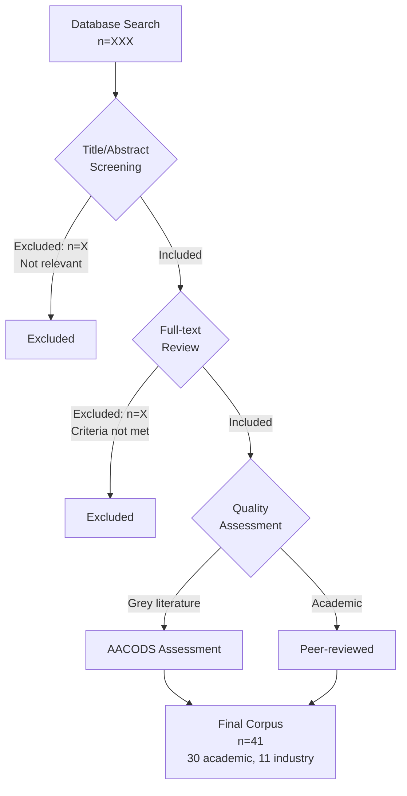

# Specification: Paper 1 Revisions

**Type:** feature
**Slug:** paper-1-revisions
**Date:** 2025-12-16
**Author:** stharrold
**GitHub Issues:** #310-#324, #270, #271 (17 total with `paper-1` label)

## Overview

Transform Paper 1 (Three-Pillar Analytical Framework) from a solution-advocacy piece into a pure analytical framework contribution suitable for academic publication. This revision removes product/solution recommendations, strengthens methodology documentation, and repositions the paper as an original analytical contribution to healthcare informatics literature.

## Implementation Context

**BMAD Planning:** See `planning/paper-1-revisions/` for complete requirements and architecture.

**Scope:** Documentation-only changes to `paper.md` and supporting files. No code changes.

**Implementation Preferences:**
- **Task Granularity:** Small tasks (1-2 hours each)
- **Follow Epic Order:** True
- **Execution:** Sequential epics (1→2→3→4→5→6)

## Requirements Reference

Full requirements documented in: `planning/paper-1-revisions/requirements.md`

### Functional Requirements Summary

| ID | Requirement | Priority |
|----|-------------|----------|
| FR-1 | Remove Section 5 (Proposed Solution) and Section 6 (Evaluation) | P0 |
| FR-2 | Revise Section 4.7 - remove speculative market claims | P0 |
| FR-3 | Add methodology enhancements (search table, flow diagram, limitations) | P0 |
| FR-4 | Add Framework Development and Validation section | P1 |
| FR-5 | Remove promotional language throughout | P1 |
| FR-6 | Create submission preparation materials | Doc |

### Non-Functional Requirements

| ID | Requirement |
|----|-------------|
| NFR-1 | Maintain objective, scholarly tone |
| NFR-2 | Update section numbering after removals |
| NFR-3 | Pass all validation tests |

## Detailed Specification

### Component 1: Content Removal (Epic 1)

**Files:** `paper.md`

**Purpose:** Remove solution-advocacy content to establish paper as analytical framework.

**Current State:**
```
1. Executive Summary
2. Introduction
3. Methodology
4. Literature Review (with Section 4.7)
5. Proposed Solution         <-- REMOVE
6. Evaluation               <-- REMOVE
7. Discussion
8. Conclusion
9. References
10. Appendices
```

**Target State:**
```
1. Executive Summary
2. Introduction
3. Methodology (enhanced)
4. Framework Development and Validation (NEW)
5. Literature Review (Section 4.7 revised)
6. Discussion
7. Conclusion (framework-focused)
8. References
9. Appendices
```

**Removed Content Preservation:**
- Content remains in git history
- Tagged for Paper 2 reference
- Revision strategy documented in `ppr_review/20251215_Revision-Strategy-Milestones.md`

### Component 2: Section 4.7 Revisions (Epic 2)

**Files:** `paper.md` (Section 4.7: "Why the Problem Persists")

**Purpose:** Replace speculative vendor motivation claims with factual observations.

**Current Issues:**
- Claims about vendor "structural disincentives" for interoperability
- Causal attribution to vendor business strategies
- Watson Health [I9] and Haven [I10] cited as evidence of motivation

**Target State:**
- Watson Health and Haven described as factual market events
- No causal claims about vendor intentions
- Research caveat paragraph acknowledging correlation ≠ causation

**Example Revision:**

Before:
> The discontinuation of IBM Watson Health [I9] and the dissolution of Haven [I10]
> demonstrate the structural disincentives vendors have for true interoperability.

After:
> IBM Watson Health was discontinued in 2022 [I9] and Haven dissolved in 2021 [I10],
> representing notable market events. These observations represent documented outcomes;
> however, establishing causal mechanisms between organizational incentive structures
> and interoperability outcomes requires controlled empirical research beyond this
> review's scope.

### Component 3: Methodology Enhancements (Epic 3)

**Files:**
- `paper.md` (Section 3: Methodology)
- `figures/literature-flow.mmd` (new)
- `figures/literature-flow.jpg` (generated)

**Purpose:** Strengthen methodology documentation per academic standards.

#### 3.1 Search Strategy Table

**Location:** Section 3, after search description

**Format:**
| Database | Search Terms | Date Range | Initial Results |
|----------|--------------|------------|-----------------|
| PubMed | ("natural language" OR "NLP") AND ("SQL" OR "query") AND "healthcare" | 2015-2024 | TBD |
| Google Scholar | healthcare analytics "natural language to SQL" | 2015-2024 | TBD |
| ACM Digital Library | healthcare data query natural language | 2015-2024 | TBD |
| IEEE Xplore | healthcare NLP database query | 2015-2024 | TBD |
| Semantic Scholar | healthcare analytics conversational AI | 2015-2024 | TBD |

#### 3.2 Literature Flow Diagram

**File:** `figures/literature-flow.mmd`



#### 3.3 Limitations Documentation

**New paragraphs in Limitations section:**

1. **Single-coder limitation:**
   > Literature screening and theme extraction were performed by a single researcher,
   > introducing potential selection and interpretation bias. Future research should
   > employ independent coding with inter-rater reliability assessment.

2. **[A10] data age limitation:**
   > The primary workforce turnover statistics derive from O'Brien-Pallas et al.
   > (2004) [A10], data now 20 years old. Healthcare workforce dynamics have evolved
   > significantly; updated empirical research is needed to validate contemporary
   > turnover rates and their impacts.

### Component 4: Framework Development Section (Epic 4)

**Files:** `paper.md` (new Section 4)

**Purpose:** Document framework development methodology and theoretical grounding.

**Section Structure:**

```markdown
## 4. Framework Development and Validation

### 4.1 Development Process

The three-pillar framework emerged through iterative analysis of the
literature corpus, identifying recurring themes across healthcare analytics
challenges. The pillars represent orthogonal yet interconnected dimensions:

1. **Analytics Maturity** - Organizational capability progression
2. **Workforce Dynamics** - Human capital and knowledge retention
3. **Technical Barriers** - NL-to-SQL and interoperability challenges

### 4.2 Theoretical Grounding

The framework aligns with established models:

| Framework Pillar | HIMSS AMAM Alignment | DIKW Hierarchy |
|------------------|----------------------|----------------|
| Analytics Maturity | Stages 0-7 progression | Data → Information |
| Workforce Dynamics | Knowledge management | Information → Knowledge (tacit) |
| Technical Barriers | Stage 6-7 requirements | Knowledge → Wisdom |

### 4.3 Validation Approach

Framework validity assessed through:
- Internal consistency across literature themes
- Alignment with existing healthcare informatics models
- Expert review (pending)
```

### Component 5: Language Cleanup (Epic 5)

**Files:** `paper.md` (throughout)

**Purpose:** Remove promotional language, maintain scholarly objectivity.

**Phrase Replacements:**

| Remove | Replace With |
|--------|--------------|
| "strategic imperative" (3x) | "identified priority" or delete |
| "urgent need" | "documented need" / "identified gap" |
| "devastating" | "significant" / "substantial" |
| "call to action" | Delete or "future research direction" |
| "competitive advantage" | Delete |

**COI Statement Update:**

Current (example):
> The authors declare no conflicts of interest.

Revised:
> **Conflicts of Interest:** The first author is affiliated with Yuimedi Corp.,
> which develops healthcare analytics software. This paper presents an analytical
> framework derived from published literature and does not evaluate or recommend
> specific products, including those of the author's employer.

### Component 6: Submission Materials (Epic 6)

**Files:** New files in `ppr_review/`

#### 6.1 Expert Review Checklist

**File:** `ppr_review/expert-review-checklist.md`

**Sections:**
- Framework validity (logical coherence, pillar independence)
- Evidence quality (citation appropriateness, grey literature justification)
- Methodology (search strategy completeness, limitation acknowledgment)
- Language/tone (objectivity, absence of promotional language)

#### 6.2 OSF Registration Draft

**File:** `ppr_review/osf-registration-draft.md`

**Contents:**
- Research questions (post-hoc declaration)
- Methodology description
- Note: Post-hoc registration (study completed)

#### 6.3 arXiv Submission Checklist

**File:** `ppr_review/arxiv-submission-checklist.md`

**Contents:**
- Primary category: cs.CL (Computation and Language)
- Cross-lists: cs.DB, cs.HC, cs.CY
- PDF format requirements (Type 1 fonts, 10MB limit)
- Metadata fields required

#### 6.4 Zenodo Submission Checklist

**File:** `ppr_review/zenodo-submission-checklist.md`

**Contents:**
- DOI reservation process
- Metadata requirements
- License: CC BY 4.0
- Version tagging strategy

## Quality Gates

### Validation Requirements

```bash
# Must pass before completion
./validate_documentation.sh                    # 7 tests
python scripts/validate_references.py --all   # Reference validation
./scripts/build_paper.sh --format all         # PDF/HTML/DOCX generation
```

### Prohibited Content Checks

```bash
# Should return no matches
grep -i "strategic imperative" paper.md
grep -i "call to action" paper.md
grep -i "devastating" paper.md
grep -i "competitive advantage" paper.md
grep "## 5\. Proposed" paper.md
grep "## 6\. Evaluation" paper.md
```

### Required Content Checks

```bash
# Should return matches
grep "Framework Development" paper.md
grep -i "AMAM\|DIKW" paper.md
grep -i "single.*coder\|single.*author" paper.md
grep -A 5 "Search Strategy" paper.md
```

## Acceptance Criteria

From `planning/paper-1-revisions/requirements.md`:

- [ ] Paper contains no product recommendations or vendor mentions
- [ ] All statistics qualified appropriately (especially [A10])
- [ ] Methodology section includes search strategy table and literature flow diagram
- [ ] Framework development process documented
- [ ] Three-pillar framework clearly articulated as novel contribution
- [ ] Limitations section addresses single-author bias
- [ ] Section 4.7 contains no speculative causal claims
- [ ] COI statement accurate
- [ ] No promotional language remains
- [ ] Conclusion emphasizes analytical framework value
- [ ] Submission materials prepared for arXiv, Zenodo, OSF, expert review
- [ ] All 17 GitHub issues closeable with commit references

## References

- **Planning documents:** `planning/paper-1-revisions/`
- **Revision strategy:** `ppr_review/20251215_Revision-Strategy-Milestones.md`
- **Journal guide:** `docs/journal-submission-guide.md`
- **AACODS assessment:** `ppr_review/20251215_AACODS-Grey-Literature.md`
